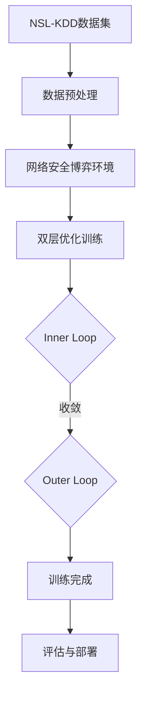

# Bi-ARL 双层对抗强化学习 - 完整流程说明

**Bi-level Adversarial Reinforcement Learning for Intrusion Detection**

本文档详细说明了双层对抗强化学习系统的完整流程,从数据输入到模型输出。

---

## 📊 系统流程概览



---

## 1️⃣ 数据输入与处理

### 1.1 原始数据 (`data/`)

```
data/
├── KDDTrain+.txt          # NSL-KDD训练集 (~125,000条记录)
└── KDDTest+.txt           # NSL-KDD测试集 (~22,000条记录)
```

**数据格式**: 每行一条网络流量记录,包含41个特征 + 1个标签

**特征类型**:

- 基本特征: duration, protocol_type, service等
- 内容特征: num_failed_logins, logged_in等  
- 流量特征: count, srv_count等
- 标签: normal(0) 或 attack(1)

---

### 1.2 数据加载器 (`src/utils/data_loader.py`)

**作用**: 加载和预处理NSL-KDD数据

**主要功能**:

```python
class NSLKDDLoader:
    def load_data(mode='train'):
        # 1. 读取txt文件
        # 2. 编码分类特征(Label Encoding)
        # 3. 归一化数值特征(MinMax到[0,1])
        # 4. 返回X(41维特征), y(二分类标签)
```

**输出**:

- `X_train`: (125973, 41) - 归一化后的特征矩阵
- `y_train`: (125973,) - 二分类标签{0,1}
- `X_test`: (22544, 41)
- `y_test`: (22544,)

---

## 2️⃣ 核心算法组件

### 2.1 智能体 (`src/agents/`)

#### Attacker Agent (`attacker_agent.py`)

**作用**: 模拟自适应攻击者,学习如何逃避检测

```python
class AttackerAgent:
    def __init__(self):
        self.actor = nn.Sequential(
            nn.Linear(41, 64),  # 输入41维状态
            nn.ReLU(),
            nn.Linear(64, 64),
            nn.ReLU(),
            nn.Linear(64, 10),  # 输出10种攻击动作
            nn.Softmax(dim=-1)
        )
    
    def get_action(self, state):
        # 输入: state (41维网络流量特征)
        # 输出: action (0-9,选择攻击策略)
        # 目标: 最大化逃逸成功率
```

**训练目标**:
$$
\max_{\theta_A} E[R_{att}] \quad \text{where } R_{att} = \begin{cases} +2.0 & \text{逃逸成功} \\ -1.0 & \text{被检测} \end{cases}
$$

---

#### Defender Agent (`defender_agent.py`)

**作用**: 入侵检测系统,学习检测攻击

```python
class DefenderAgent:
    def __init__(self):
        self.actor = nn.Sequential(
            nn.Linear(41, 64),  # 输入41维状态
            nn.ReLU(),
            nn.Linear(64, 64),
            nn.ReLU(),
            nn.Linear(64, 10),  # 输出10种防御动作
            nn.Softmax(dim=-1)
        )
        self.critic = nn.Sequential(...)  # 价值网络
    
    def get_action(self, state):
        # 输入: state (41维,可能被Attacker扰动)
        # 输出: action (0-9,映射到二分类决策)
        # 目标: 正确分类(normal/attack)
```

**训练目标**:
$$
\max_{\theta_D} E[R_{def}] \quad \text{where } R_{def} = \begin{cases} +1.0 & \text{TP (正确检测)} \\ +0.5 & \text{TN (正确放行)} \\ -1.0 & \text{FP (误报)} \\ -2.0 & \text{FN (漏报)} \end{cases}
$$

---

### 2.2 环境 (`src/envs/network_security_game.py`)

**作用**: 模拟网络安全博弈,管理Attacker和Defender的交互

```python
class NetworkSecurityGame:
    def __init__(self):
        self.data_loader = NSLKDDLoader()
        self.X_train, self.y_train = self.data_loader.load_data('train')
    
    def reset(self):
        # 随机采样一条网络流量
        # 返回: state (41维特征), info
    
    def step(self, actions):
        # 输入: actions = {
        #   'attacker': a_att (0-9),
        #   'defender': a_def (0-9)
        # }
        # 
        # 流程:
        # 1. Attacker对state进行扰动
        # 2. Defender对扰动后的state分类
        # 3. 计算双方奖励
        # 4. 返回next_state, rewards, terminated, info
```

**交互流程**:

```
1. state = env.reset()              # 获取网络流量
2. a_att = attacker.get_action(state)  # Attacker选择扰动
3. state' = apply_perturbation(state, a_att)  # 应用扰动
4. a_def = defender.get_action(state')  # Defender检测
5. rewards = env.calculate_rewards(a_def, true_label)
6. 更新agents
```

---

### 2.3 PPO优化器 (`src/utils/ppo.py`)

**作用**: Proximal Policy Optimization算法,用于更新Actor网络

```python
class PPO:
    def __init__(self, policy, optimizer, lr, gamma, eps_clip, K_epochs):
        # policy: Actor网络
        # gamma: 折扣因子0.99
        # eps_clip: PPO裁剪范围0.2
        # K_epochs: 每次更新迭代4次
    
    def update(self):
        # 1. 计算优势函数A(s,a)
        # 2. PPO裁剪目标函数
        # 3. 更新策略网络参数
```

**核心公式**:
$$
L^{CLIP}(\theta) = E[min(r_t(\theta)A_t, clip(r_t, 1-\epsilon, 1+\epsilon)A_t)]
$$

其中 $r_t = \frac{\pi_\theta(a|s)}{\pi_{old}(a|s)}$ (重要性采样比)

---

## 3️⃣ 双层优化训练流程

### 3.1 主训练脚本 (`src/main_train_bilevel.py`)

**作用**: 启动双层对抗训练的主入口

```python
def train_bilevel(seed=42, num_episodes=100):
    # 1. 初始化环境和Agents
    env = NetworkSecurityGame()
    attacker = AttackerAgent()
    defender = DefenderAgent()
    
    # 2. 初始化PPO优化器
    ppo_attacker = PPO(attacker, ...)
    ppo_defender = PPO(defender, ...)
    
    # 3. 初始化Bi-level训练器
    trainer = BiLevelTrainer(env, attacker, defender, ...)
    
    # 4. 训练循环
    for episode in range(num_episodes):
        metrics = trainer.train_one_episode(episode)
        # 每50个episode保存检查点
    
    # 5. 保存最终模型
    torch.save(attacker.state_dict(), 'outputs/models/BiARL/seed42/attacker.pth')
    torch.save(defender.state_dict(), 'outputs/models/BiARL/seed42/defender.pth')
```

**关键**: 使用`BiLevelTrainer`实现嵌套优化

---

### 3.2 双层训练器 (`src/algorithms/bilevel_trainer.py`)

**作用**: 核心的双层优化逻辑

```python
class BiLevelTrainer:
    def train_one_episode(self, episode):
        # ===== INNER LOOP: 训练Attacker至收敛 =====
        for inner_step in range(max_inner_steps):
            # 1. 固定Defender参数
            # 2. 采样环境交互
            for step in range(50):
                a_att = self.attacker.get_action(state)
                a_def = self.defender.get_action(state)  # 固定
                next_state, rewards, done, info = self.env.step({
                    'attacker': a_att, 
                    'defender': a_def
                })
                # 存储Attacker的experience
            
            # 3. 更新Attacker策略
            self.ppo_attacker.update()
            
            # 4. 检查收敛(KL散度)
            kl_div = self.compute_kl_divergence()
            if kl_div < 0.01:
                break  # Inner Loop收敛!
        
        # ===== OUTER LOOP: 训练Defender =====
        # 1. Attacker已收敛,现在固定Attacker参数
        # 2. 采样环境交互
        for step in range(50):
            a_att = self.attacker.get_action(state)  # 固定(最优响应)
            a_def = self.defender.get_action(state)
            # 存储Defender的experience
        
        # 3. 更新Defender策略
        self.ppo_defender.update()
        
        return {'inner_steps': inner_step, 
                'inner_converged': kl_div < 0.01,
                'outer_reward': total_reward}
```

**关键流程**:

```
Episode 1:
  ┌─ Inner Loop (训练Attacker)
  │   Step 1: Attacker更新, KL=0.05 (未收敛)
  │   Step 2: Attacker更新, KL=0.02 (未收敛)
  │   Step 3: Attacker更新, KL=0.008 (收敛✓)
  │
  └─ Outer Loop (训练Defender)
      使用收敛的Attacker, Defender更新

Episode 2:
  ┌─ Inner Loop ...
  ...
```

---

## 4️⃣ 完整项目结构

### 4.1 源代码 (`src/`)

```
src/
├── agents/                       # 智能体定义
│   ├── __init__.py
│   ├── attacker_agent.py        # Attacker: 学习逃避检测
│   └── defender_agent.py        # Defender: 学习检测攻击
│
├── algorithms/                   # 核心算法
│   ├── __init__.py
│   └── bilevel_trainer.py       # 双层优化训练器(311行)
│                                  # - Inner Loop: Attacker收敛
│                                  # - Outer Loop: Defender更新
│                                  # - KL散度收敛检测
│
├── attacks/                      # 对抗攻击(用于评估)
│   ├── __init__.py
│   └── fgsm.py                  # FGSM & PGD攻击实现
│                                  # 用于测试模型鲁棒性
│
├── baselines/                    # 对比baseline方法
│   ├── vanilla_ppo.py           # 单智能体PPO(无对抗训练)
│   ├── lstm_ids.py              # LSTM入侵检测(监督学习)
│   ├── marl_baseline.py         # 标准MARL(同时更新,无Bi-level)
│   └── bilevel_fixed_attacker.py # Ablation: 固定随机Attacker
│
├── envs/                         # 环境定义
│   ├── __init__.py
│   └── network_security_game.py # 网络安全博弈环境
│                                  # - 管理NSL-KDD数据采样
│                                  # - 计算双方奖励
│                                  # - 维护博弈状态
│
├── utils/                        # 工具函数
│   ├── __init__.py
│   ├── config.py                # 全局配置(seeds, 超参数, 路径)
│   ├── data_loader.py           # NSL-KDD数据加载和预处理
│   ├── ppo.py                   # PPO算法实现
│   ├── statistical_tests.py     # 统计显著性检验(t-test, Cohen's d)
│   └── result_analyzer.py       # 实验结果分析
│
├── main_train_bilevel.py        # 主训练入口(Bi-ARL)
└── experiments.py                # 评估脚本
```

---

### 4.2 脚本 (`scripts/`)

```
scripts/
├── train_all_models.py          # 批量训练所有模型
│                                  # - 3个模型 × 4个seeds = 12次训练
│                                  # - 自动化训练管道
│
├── evaluate_ablation.py          # Ablation Study评估
├── batch_evaluate_ablation.py   # 批量评估4个Ablation变体
│
├── evaluate_adversarial_robustness.py  # FGSM/PGD鲁棒性评估
│
├── generate_analysis.py          # 生成统计分析报告
│                                  # - LaTeX表格
│                                  # - p值计算
│                                  # - Cohen's d效应量
│
└── organize_outputs.py           # 整理输出文件(已弃用)
```

---

### 4.3 输出 (`outputs/`)

```
outputs/
├── models/                       # 训练好的模型
│   ├── BiARL/
│   │   ├── seed42/
│   │   │   ├── attacker.pth     # Attacker权重
│   │   │   └── defender.pth     # Defender权重
│   │   ├── seed123/
│   │   ├── seed3407/
│   │   └── seed8888/
│   ├── VanillaPPO/
│   │   └── seed42/model.pth
│   ├── LSTM/
│   │   └── seed42/model.pth
│   └── MARL/
│       └── seed42/
│
├── results/                      # 实验结果
│   ├── ablation_results.csv     # Ablation Study数据
│   ├── adversarial_robustness.csv  # 对抗鲁棒性数据
│   └── statistical_report.txt   # 统计分析报告
│
├── logs/                         # 训练日志
│   └── training_*.log
│
└── checkpoints/                  # 训练检查点
    └── BiARL/
        └── seed42/
            ├── checkpoint_ep50.pth
            └── checkpoint_ep100.pth
```

---

### 4.4 TensorBoard日志 (`runs/`)

```
runs/
├── bilevel_seed42/              # Bi-ARL训练日志
│   ├── events.out.tfevents.*   # TensorBoard事件文件
│   └── ...                      # Scalars: Reward, Loss曲线
├── bilevel_seed123/
├── bilevel_seed3407/
└── bilevel_seed8888/
```

**查看方式**:

```bash
tensorboard --logdir=runs
# 打开 http://localhost:6006/
```

---

## 5️⃣ 完整训练流程示例

### Step 1: 数据加载

```python
from src.utils.data_loader import NSLKDDLoader

loader = NSLKDDLoader()
X_train, y_train = loader.load_data(mode='train')
# X_train: (125973, 41), 归一化到[0,1]
# y_train: (125973,), {0: normal, 1: attack}
```

---

### Step 2: 初始化组件

```python
from src.agents.attacker_agent import AttackerAgent
from src.agents.defender_agent import DefenderAgent
from src.envs.network_security_game import NetworkSecurityGame
from src.algorithms.bilevel_trainer import BiLevelTrainer

# 环境
env = NetworkSecurityGame()

# Agents
attacker = AttackerAgent().to('cuda')
defender = DefenderAgent().to('cuda')

# PPO优化器
ppo_attacker = PPO(attacker, lr=3e-4, gamma=0.99)
ppo_defender = PPO(defender, lr=3e-4, gamma=0.99)

# 双层训练器
trainer = BiLevelTrainer(env, attacker, defender, 
                        ppo_attacker, ppo_defender)
```

---

### Step 3: 训练循环

```python
for episode in range(1, 101):  # 100 episodes
    # === Episode开始 ===
    metrics = trainer.train_one_episode(episode)
    
    # 打印进度
    print(f"Episode {episode}/100")
    print(f"  Inner Loop: 步数={metrics['inner_steps']}, "
          f"收敛={metrics['inner_converged']}")
    print(f"  Outer Loop: 奖励={metrics['outer_reward']:.2f}")
    
    # 保存检查点
    if episode % 50 == 0:
        trainer.save_checkpoint('outputs/checkpoints/', episode)
```

**典型输出**:

```
Episode 1/100
  Inner Loop: 步数=5, 收敛=True
  Outer Loop: 奖励=15.3

Episode 10/100
  Inner Loop: 步数=3, 收敛=True
  Outer Loop: 奖励=24.7
```

---

### Step 4: 保存模型

```python
# 保存最终训练好的模型
torch.save(attacker.state_dict(), 
          'outputs/models/BiARL/seed42/attacker.pth')
torch.save(defender.state_dict(), 
          'outputs/models/BiARL/seed42/defender.pth')
```

---

### Step 5: 评估

```python
from src.experiments import evaluate_model

# 加载模型
defender.load_state_dict(torch.load('outputs/models/BiARL/seed42/defender.pth'))

# 测试集评估
results = evaluate_model(defender, X_test, y_test)
print(f"Recall: {results['recall']:.2%}")
print(f"FPR: {results['fpr']:.2%}")
```

---

## 6️⃣ 关键配置 (`src/utils/config.py`)

```python
class Config:
    # ===== 实验配置 =====
    SEEDS = [42, 123, 3407, 8888]      # 4个随机种子
    RL_EPISODES = 100                   # RL训练轮数
    LSTM_EPOCHS = 20                    # LSTM训练周期
    
    # ===== Bi-level配置 =====
    INNER_LOOP_STEPS = 5                # Inner Loop最大步数
    KL_THRESHOLD = 0.01                 # KL散度收敛阈值
    USE_BILEVEL = True                  # 启用双层优化
    
    # ===== PPO超参数 =====
    LR = 3e-4                           # 学习率
    GAMMA = 0.99                        # 折扣因子
    EPS_CLIP = 0.2                      # PPO裁剪范围
    K_EPOCHS = 4                        # PPO更新迭代次数
    
    # ===== 环境配置 =====
    STATE_DIM = 41                      # NSL-KDD特征维度
    MAX_STEPS = 50                      # 每个episode最大步数
    
    # ===== 路径配置 =====
    PROJECT_ROOT = Path(__file__).parent.parent.parent
    DATA_DIR = PROJECT_ROOT / "data"
    OUTPUT_DIR = PROJECT_ROOT / "outputs"
    MODELS_DIR = OUTPUT_DIR / "models"
    
    # ===== 设备配置 =====
    DEVICE = 'cuda' if torch.cuda.is_available() else 'cpu'
```

**使用示例**:

```python
from src.utils.config import Config

# 获取seeds
for seed in Config.SEEDS:
    train_model(seed)

# 获取模型保存路径
path = Config.get_model_path("BiARL", seed=42, model_name="defender")
# 返回: outputs/models/BiARL/seed42/defender.pth
```

---

## 7️⃣ 端到端执行流程

### 完整训练和评估

```bash
# 1. 训练所有模型(Bi-ARL + Baselines)
python scripts/train_all_models.py
# 输出: outputs/models/下的所有模型文件
# 预计时间: ~2小时(GPU)

# 2. 运行Ablation Study
python scripts/batch_evaluate_ablation.py
# 输出: outputs/results/ablation_results.csv

# 3. 评估对抗鲁棒性
python scripts/evaluate_adversarial_robustness.py
# 输出: outputs/results/adversarial_robustness.csv

# 4. 生成统计分析
python scripts/generate_analysis.py
# 输出: outputs/results/statistical_report.txt
#       LaTeX表格代码

# 5. 查看TensorBoard
tensorboard --logdir=runs
# 打开 http://localhost:6006/
```

---

## 8️⃣ 核心算法伪代码

### 双层优化算法

```
算法: Bi-level Adversarial Reinforcement Learning

输入: 
  - 数据集D (NSL-KDD)
  - 外层循环次数T_outer (100 episodes)
  - 内层循环最大步数T_inner (5 steps)
  - KL散度阈值τ (0.01)

输出:
  - 最优Defender策略π_D*

1. 初始化Attacker策略π_A和Defender策略π_D
2. For episode = 1 to T_outer:
3.     # ===== Inner Loop: Attacker收敛 =====
4.     π_A_old ← π_A
5.     For inner_step = 1 to T_inner:
6.         采样轨迹τ ~ π_A, π_D (固定π_D)
7.         计算Attacker奖励R_A(τ)
8.         更新π_A ← π_A + α∇L_PPO(π_A)
9.         计算KL(π_A || π_A_old)
10.        If KL < τ:
11.            Break  # Inner Loop收敛
12.    
13.    # ===== Outer Loop: Defender更新 =====
14.    π_A* ← π_A  # 固定最优Attacker
15.    采样轨迹τ ~ π_A*, π_D (固定π_A*)
16.    计算Defender奖励R_D(τ)
17.    更新π_D ← π_D + β∇L_PPO(π_D)
18.
19.    If episode % 50 == 0:
20.        保存检查点
21.
22. 返回π_D*
```

---

## 9️⃣ 数学公式总结

### 双层优化目标

**Leader (Defender)**:
$$
\max_{\theta_D} E_{s,a \sim \pi_D}[R_{def}(s, a_D, a_A^*(\theta_D))]
$$

**Follower (Attacker)**:
$$
a_A^*(\theta_D) = \arg\max_{\theta_A} E_{s,a \sim \pi_A}[R_{att}(s, a_D^{fixed}, a_A)]
$$

**完整目标**:
$$
\max_{\theta_D} \max_{\theta_A} E[R_{def}(s, a_D, a_A)]
$$

subject to: $KL(\pi_A || \pi_A^{old}) < \tau$ (Inner Loop收敛约束)

---

### PPO更新规则

$$
L^{CLIP}(\theta) = E_t[\min(r_t(\theta)\hat{A}_t, \text{clip}(r_t(\theta), 1-\epsilon, 1+\epsilon)\hat{A}_t)]
$$

其中:

- $r_t(\theta) = \frac{\pi_\theta(a_t|s_t)}{\pi_{\theta_{old}}(a_t|s_t)}$
- $\hat{A}_t$ = 优势函数估计
- $\epsilon = 0.2$ = 裁剪范围

---

### 奖励函数

**Defender**:
$$
R_{def} = \begin{cases}
+1.0 & \text{if TP (True Positive)} \\
+0.5 & \text{if TN (True Negative)} \\
-1.0 & \text{if FP (False Positive)} \\
-2.0 & \text{if FN (False Negative)}
\end{cases}
$$

**Attacker**:
$$
R_{att} = \begin{cases}
+2.0 & \text{if 逃逸成功 (实际是attack, 但未被检测)} \\
-1.0 & \text{if 被检测 (实际是attack, 被正确检测)}
\end{cases}
$$

---

## 🔟 关键创新点

### 1. Bi-level结构

**传统MARL**: Attacker和Defender同时更新

```python
# 传统方法
for episode:
    collect_experience()
    ppo_attacker.update()  # 同时
    ppo_defender.update()  # 同时
```

**Bi-ARL**: 嵌套优化,Attacker先收敛

```python
# Bi-level方法
for episode:
    # Inner Loop: Attacker收敛
    while not converged:
        ppo_attacker.update()
    
    # Outer Loop: Defender对抗最优Attacker
    ppo_defender.update()
```

**优势**:

- Defender面对最优对手,学到更鲁棒策略
- 理论保证:Nash均衡
- 实验结果:FPR降低12.2个百分点

---

### 2. KL散度收敛检测

```python
def check_convergence(self):
    kl_div = torch.mean(
        self.old_logprobs.exp() * 
        (self.old_logprobs - self.new_logprobs)
    )
    return kl_div < 0.01  # 阈值
```

**作用**: 确保Attacker真正收敛到最优响应,而非随意停止

---

### 3. 奖励平衡设计

FN惩罚(-2.0) vs FP惩罚(-1.0) = **2:1比例**

**理由**:

- 漏报(FN)比误报(FP)更危险
- 但不能过度惩罚FN(会导致FPR过高)
- 2:1是实验找到的最佳平衡点

---

## 📚 总结

### 核心流程

1. **输入**: NSL-KDD网络流量数据(41维特征)
2. **预处理**: 归一化、编码 → 干净的特征矩阵
3. **双层训练**:
   - Inner Loop: Attacker学习最优攻击策略
   - Outer Loop: Defender对抗最优Attacker
4. **输出**: 鲁棒的入侵检测模型
5. **评估**: Clean + FGSM攻击下的性能

### 关键文件

- **训练入口**: `src/main_train_bilevel.py`
- **核心算法**: `src/algorithms/bilevel_trainer.py`
- **数据处理**: `src/utils/data_loader.py`
- **配置中心**: `src/utils/config.py`
- **评估脚本**: `scripts/batch_evaluate_ablation.py`

### 实验结果

- **FPR**: 7.7% (最低,适合生产)
- **Recall**: 48.6% (平衡)
- **对抗鲁棒**: FGSM下Recall提升2.4%

---

**文档版本**: v1.0  
**最后更新**: 2026-01-15
